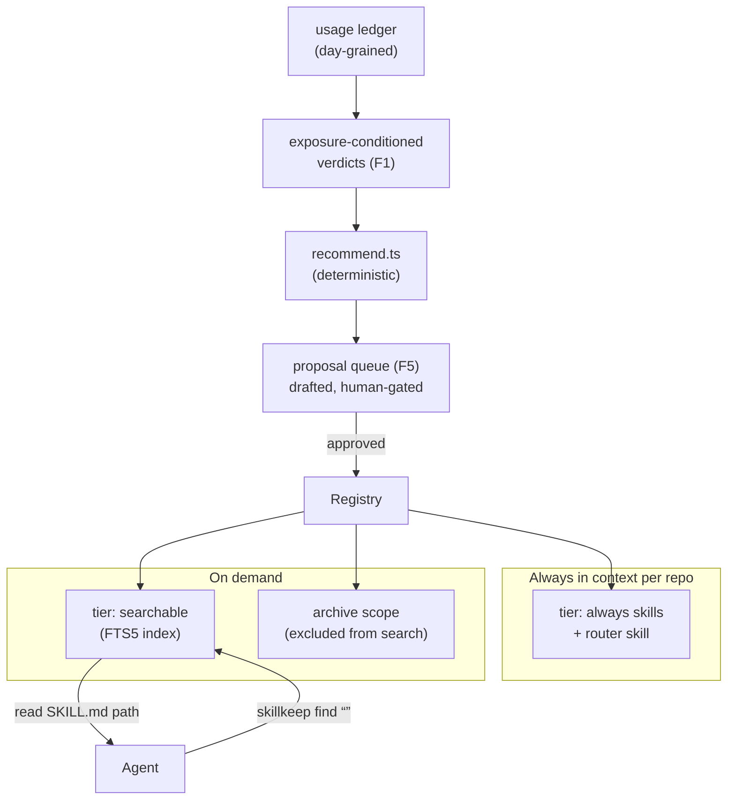

# Spec: skillkeep as gardener + router

Status: reviewed — revision 2 after adversarial review (see §17)
Date: 2026-07-07
Owner: George

## 1. Thesis

skillkeep today is a librarian: it stores skills, syncs them into client dirs, prunes via triage. This spec redefines the product as an **attention manager**: the unit of value is not "skill file managed" but *the right skill in context at the right moment, for minimum tokens*.

Three costs drive every design decision here:

1. **Attention cost** — every always-loaded skill's name+description dilutes the routing of every other skill and burns context in every session.
2. **Routing precision** — a skill that never fires when it should (stale description, buried in 200 siblings) is worth zero regardless of body quality.
3. **Rot** — near-duplicates, dead skills, and per-repo forks that drift from their base.

skillkeep's defensible asset is the closed loop no harness vendor ships: **usage telemetry → lifecycle decisions → consolidation → per-repo adaptation**. It already parses per-session, per-skill usage from client logs (`skill_usage`) joined to a registry catalog. This spec wires that loop.

## 2. Terminology

- **Registry** — the git repo at `config.registryRoot`, layout `skills/<scope>/<name>/SKILL.md`.
- **Scope** — *where a skill belongs*: `global`, `project/<name>`, `profile/<name>`, `archive` (grammar enforced by `ensureScopeDirName`, `packages/core/src/registry.ts`). Unchanged by this spec. `archive` remains a scope, not a tier.
- **Tier** — *how visible a non-archive skill is* (new, orthogonal to scope): `always` (deployed into client dirs, in context every session) or `searchable` (not deployed; discoverable at runtime via `skillkeep find`). Archive-scope skills have no tier; they are excluded from deployment *and* search.
- **Exposure** — the number of distinct active days in which a skill *could* have fired.
- **Router** — the mechanism by which an agent mid-session discovers and loads a `searchable` skill.
- **Proposal** — a machine-drafted, human-gated lifecycle action.

## 3. Architecture



## 4. F1 — Exposure-conditioned staleness

**Problem.** The current rule (`recommend.ts`: zero `skill_usage` rows in `RECOMMEND_WINDOW_DAYS = 60` wall-clock days) has two defects. First, it only covers `global`-scope skills (`buildRecommendations` filters `scope === "global"`), so project/profile skills get **no lifecycle signal at all** — extending the wall-clock rule to them naively would mis-flag every skill in a dormant repo. Second, even for globals, wall-clock days confound machine dormancy with skill staleness: 60 quiet days on an idle machine says nothing.

**Design.** The ledger is day-grained — `usage_facts` PK is `(day, client, model, repo, device)`, `skill_usage` PK is `(day, skill, client, repo, model, device)`; there is no session table — so the exposure denominator is **active days**, not sessions.

Within a rolling window `EXPOSURE_WINDOW_DAYS = 90` (replaces `RECOMMEND_WINDOW_DAYS` outright; no other consumer keeps the old constant), per skill:

- `scopeRepos(skill)`: for `project/<p>`, the repos of `config.projects[p]`; for `global`/`profile`, all repos.
- `exposureDays` = count of distinct `usage_facts.day` where `repo ∈ scopeRepos` (all devices, `device IS NULL` local rows included). `skill_usage` rows whose `repo` is unattributable count toward global exposure only.
- `uses` = sum of `skill_usage.count` for the skill over the same filter.

| Verdict | Condition | Consequence |
|---|---|---|
| `active` | `uses > 0` | none |
| `stale` | `uses = 0 ∧ exposureDays ≥ MIN_EXPOSURE_DAYS (10)` | demotion candidate (F5) |
| `dormant` | `uses = 0 ∧ exposureDays < MIN_EXPOSURE_DAYS` | held — never flagged |

Thresholds are named constants, and **M1 ships a calibration report before anything acts on them**: `skillkeep report exposure` prints the verdict distribution over the real ledger (per scope, per verdict, with the borderline skills named) so `90`/`10` are adjusted against observed data, not assumed.

**Implementation.** `buildRecommendations` stays pure: `RecommendInput.usedSkillNames: Set<string>` is replaced by `exposure: Map<string, { exposureDays: number; uses: number }>`; a new query helper in `usage-store.ts` computes the map. `unused-skill` becomes `stale-skill`, now emitted for project/profile scopes too, and carries the verdict inputs in `detail`.

**Acceptance.** Unit tests: project skill with zero exposure days never flagged; global skill with 0 uses across ≥10 active days flagged; boundary `exposureDays = 9` vs `10`; unattributed-repo rows counted only for globals.

## 5. F2 — Visibility tiers

**Problem.** Archiving today means invisible: the skill can never match again. Users therefore hoard, and the always-on list grows unboundedly.

**Design.** New optional frontmatter key on SKILL.md:

```yaml
tier: always | searchable   # absent ⇒ always
```

- `parseSkillMd` (`packages/core/src/skill.ts`) additionally extracts `tier`; invalid values ⇒ `always` + a `check` warning. `SkillMeta` gains `tier`.
- **Sync semantics — not gated on `--prune`.** Today removal of stale deployments only happens under `opts.prune`, and both `runMaintenancePass` and `/api/sync` pass `prune: false`. Tier exclusion is different in kind: a `searchable` skill is *no longer managed output*, and every sync (symlink, copy, and committed modes) removes its deployment unconditionally, exactly as it would never have deployed it. `--prune` keeps its existing meaning (dangling/unmanaged leftovers). This is a deliberate semantic addition to `runSync` and is called out in tests.
- **Search corpus** (F3) = tiers `always` + `searchable`, all scopes except `archive`.
- Demotion/promotion = a one-line frontmatter edit, git-visible, normally shipped as an F5 proposal. Scope stays untouched — a demoted `project/mag` skill still belongs to mag; it is simply no longer resident. Tiers travel between devices automatically because they live in skill content, which hub sync already ships.
- Second-stage decay (`searchable` → archive proposal) exists but is telemetry-gated; its rules live in F5 and §7's honesty constraints.

**Acceptance.** Fixture tests per mode (symlink, copy, committed): demote → sync (no `--prune`) → gone from client dirs, still in registry, still in `find`; promote → restored. `bun run ci` green.

## 6. F3 — Search index and `skillkeep find`

**Design.**

- SQLite FTS5 virtual table in the existing DB (schema v3): `skills_fts(name, description, body, scope UNINDEXED, tier UNINDEXED, path UNINDEXED)`. FTS5 availability in `bun:sqlite` is **verified** (probe: `CREATE VIRTUAL TABLE … USING fts5` + BM25 `rank` work on stock Bun); `doctor` still gains a guard for exotic builds.
- **Rebuild** = `DELETE FROM skills_fts` + re-insert from `scanRegistry` output inside one transaction (never DROP/CREATE, so concurrent WAL readers always see a coherent table). Triggered by: sync, daemon maintenance, and **lazily by `find`** — the index stores a build stamp (max mtime + skill count); on mismatch with a cheap registry stat walk, `find` rebuilds inline before querying (fast at ~200 skills). Manual SKILL.md edits are therefore picked up without a daemon.
- **`skillkeep find <query> [--limit 5] [--json]`** opens the DB directly, read-only — no daemon required. Failure ladder: DB locked/missing → fall back to a filesystem `scanRegistry` + substring match with a warning line; FTS5 unavailable → same fallback + doctor hint. `find` never hard-fails on infrastructure; worst case is degraded ranking.
- Output: rank, name, scope, tier, one-line description, absolute SKILL.md path. The agent loads a body by reading the path — no new "load" verb.
- **Telemetry**: each invocation logs `find_events(day, query, results, device)` where `results` is the JSON array of surfaced names — so "surfaced" is measurable per skill, not just per query.

**Acceptance.** Fixture-registry integration test with deterministic expected ranking (CI-gated); a manual smoke against the real 212-skill registry is a milestone checklist item, not a CI gate. Archive-scope skills never appear. Fallback path covered by a test that locks the DB.

## 7. Read-attribution: making the loop honest

The decay loop is only as good as skill-read telemetry, and today that coverage is partial — this section states it plainly rather than assuming it away.

- Skill-read events are ingested **only for `claude` and `omp`** (`usage-ingest.ts`; `packages/usage/src/skill-reads.ts`). `codex`, `gemini`, `opencode` logs carry no skill-read signal.
- The attribution matcher (`packages/usage/src/attribution.ts`) matches deployed-path shapes (`skills/<name>/SKILL.md`, `managed-skills/<name>/SKILL.md`). A `searchable` skill read via its **registry** path (`skills/<scope>/<name>/SKILL.md`) would not attribute.

**Design (ships with M2, same milestone as `find`):**

1. Extend the attribution matcher to also recognize the registry layout (`skills/global/<name>/SKILL.md`, `skills/project/<p>/<name>/SKILL.md`, …), so find-then-read on claude/omp lands in `skill_usage` like any other read.
2. Per-client telemetry capability is an explicit constant (`READ_ATTRIBUTING_CLIENTS = ["claude", "omp"]`). For skills whose window usage comes only from non-attributing clients, the F1 verdict is `unknown`, treated like `dormant` (held, never flagged).
3. **Archive proposals require positive evidence, not absence:** a `searchable` skill is proposed for archive only when (a) zero `skill_usage` reads from attributing clients, AND (b) zero `find_events` surfacings, over a full window with nonzero global exposure. Surfaced-but-never-read feeds `rewrite-description` proposals instead — the skill is discoverable but unconvincing.

## 8. F4 — Router surfaces

Three rungs, one core. Rung 1 ships with F3 (M2); rungs 2–3 are deliberately last (M5) — they are optional accelerators, not the product.

| Rung | Mechanism | Ships |
|---|---|---|
| 1. Pull | A generated **router skill** in every global farm: "starting a non-trivial task, or no loaded skill matches? run `skillkeep find '<task terms>'` and read the top hit's SKILL.md" | M2 |
| 2. Push | Client prompt-hook (Claude Code `UserPromptSubmit`, OMP extension) shells out to `skillkeep match --prompt -` and injects top-k *names+descriptions* (~100 tokens) | M5 |
| 3. MCP | `skillkeep mcp` stdio server exposing `find_skill` | M5 |

Clarification (reviewer-raised): there is no body-injection contradiction. **Unsolicited injection (rungs 2–3) never includes bodies**; a rung-1 body read is agent-initiated and deliberate — that is the entire point of pull routing.

The router skill is **generated, not registry content**: `runSync` writes it into each client farm from a template constant compiled into the binary, stamped with a template rev in its frontmatter (`x-skillkeep-router-rev`). `check` verifies presence + rev per configured client. Template wording changes ship with skillkeep releases — accepted consequence of `bun build --compile` embedding, and the wording is expected to stabilize after the M2 live evaluation (§16 Q2). `find` (and thus the router) is an **agent-device feature**: it reads the local registry clone; hub mode serves no `find`.

**Acceptance (rung 1).** Fresh sync deposits the router skill in each configured client's user dir; `check` flags a stale/missing router; the router never appears in registry scans or skill counts.

## 9. F5 — Proposal queue

**Problem.** `recommend.ts` findings are advisory dashboard lines; nothing turns them into applied changes, so they rot. AI primitives exist (`packages/server/src/ai.ts`: `suggestTriage`, `tuneDescription`, `adviseDedupe`) but have no workflow.

**Design principle.** Deterministic finder → drafter → human gates → skillkeep applies. **Auto-apply is permanently out of scope.**

**Scope discipline (reviewer-driven):** M3 ships exactly three kinds, all with mechanical or single-call drafts. `merge` (index-skill drafting via a new `draftIndexSkill` generation) and `refresh-copy` (F6 three-way) are M4+ kinds layered on the same table and routes.

### Contract

`proposals` table (schema v3, device-local, never hub-synced):

```
proposals(id INTEGER PRIMARY KEY, kind TEXT, skills TEXT /*JSON array*/,
          payload TEXT /*JSON, per-kind*/, draft TEXT, status TEXT,
          reason TEXT, created_at INTEGER, decided_at INTEGER)
-- index: (status); status ∈ pending|approved|rejected|applied|failed
```

Per-kind contract (M3):

| kind | source signal | payload | draft | apply |
|---|---|---|---|---|
| `demote` | F1 `stale` | `{scope, name, preHash}` | frontmatter diff (`tier: searchable`) | edit frontmatter, commit |
| `archive` | §7 rule 3 | `{scope, name, preHash}` | move plan | `git mv` to `archive/`, commit |
| `rewrite-description` | surfaced-never-read (§7) | `{scope, name, preHash, old}` | new description via `tuneDescription` | edit frontmatter, commit |

- `preHash` = `hashSkillDir` at draft time. **Apply re-validates it**; mismatch (manual edit or hub pull since drafting) ⇒ `status = failed`, `reason = "skill changed since draft"`, surfaced in dashboard — never a blind overwrite, never a git conflict.
- Generation runs in `runMaintenancePass` *only when the relevant drafter needs no AI or `config.ai` is set*; hard cap **5 open proposals**; a rejected `(kind, skills)` pair is suppressed for 30 days. Caps are constants revisited after the M3 calibration period, same policy as F1 thresholds.
- Apply commits are pathspec-scoped to the touched skill dirs (existing adopt/triage git machinery).

### Surfaces

- REST: `GET /api/proposals`, `POST /api/proposals/:id/approve`, `POST /api/proposals/:id/reject` (bearer-token daemon API like every other route).
- CLI: `skillkeep proposals [list|show <id>|approve <id>|reject <id>]` — talks to the daemon when healthy, else operates on the DB directly (same dual-path as other verbs).
- Dashboard section listing pending proposals with draft preview. TUI: out of scope for v1 (dashboard + CLI only).

**Acceptance.** E2E fixture: registry + ledger fixture → maintenance pass creates `demote` proposal → approve via API → frontmatter edited, pathspec-scoped commit exists, status `applied`. Precondition test: mutate the skill after drafting → approve → `failed`, registry untouched. AI kinds tested with a stubbed model.

## 10. F6 — Provenance and drift (overlays, the cheap way)

**Problem.** "Generic skill tweaked for a repo" today = copy into `project/<p>` and fork; the copy silently rots as the base improves. Full `extends:` composition was considered and **rejected** (merge semantics, section collisions, un-parseable composed output).

**Correction from review.** Draft 1 reused `skill_revs` as a content revision. That table is a **hub push counter** (`registry-sync.ts` `getSkillRev`/`setSkillRev`; `routes.ts` `newRev = parentRev + 1`) and core never touches it; overloading it would corrupt hub sync. Dropped. Provenance needs no table at all:

```yaml
origin: { scope: global, name: rust-llm-coding-discipline, hash: "sha256…" }
```

- `skillkeep tweak <name> --project <p>` copies the base skill into `project/<p>` and stamps `origin` with the base's current `hashSkillDir` (existing function, deterministic content hash).
- `recommend.ts` gains a `drift` kind: fires when the base's current hash ≠ `origin.hash`. Purely a scan-time comparison; no new state.
- The F5 `refresh-copy` proposal (M4+) drafts a re-application of local tweaks onto the new base (AI-assisted three-way: old base unavailable ⇒ diff is base-now vs copy; the draft is a proposal, so imperfect drafts cost only a rejection). Approving refreshes `origin.hash`.

**Acceptance.** Fixture: tweak, mutate base, recommend → drift flagged naming both skills. Approve refresh → `origin.hash` updated.

## 11. F7 — Stack tags (deferred)

Optional `stacks: [rust, bun, tauri]` frontmatter + deterministic marker-file detection (`Cargo.toml` → rust, `package.json` → node, …) per configured repo. Dashboard recommendations only ("repo X looks like rust; 2 rust-tagged searchable skills are not deployed there"). **Never auto-enables.** Blocked on F2 being shipped *and proven stable through one full window*; scheduled M5.

## 12. Bootstrap — day-one value for the existing registry

Reviewer-identified blocker: with every existing skill defaulting to `always`, nothing improves until demotions happen.

- **M1**: `skillkeep report exposure` (F1 calibration) — read-only, immediately useful, tunes thresholds against the real ledger.
- **M2**: `skillkeep bootstrap-tiers` — one-shot interactive pass: computes F1 verdicts over the full ledger, prints the proposed demotion set (`stale` skills → `tier: searchable`), writes approved demotions as **one reviewable git commit** to the registry. Dry-run by default; `--apply` to write. This is F5's `demote` flow run in bulk before the proposal queue exists, and it is what makes the router corpus non-empty on day one.
- Rollback story for bootstrap and consolidation alike: the registry is git — `git revert` of the bootstrap/merge commit restores the prior state; skillkeep needs no undo machinery.

## 13. Data model changes (schema v3)

- `proposals` + `find_events` tables — plain `CREATE TABLE IF NOT EXISTS`, additive; **device-local, never hub-synced** (hub push/pull remains `usage_facts`, `skill_usage`, registry skills — `hub-link.ts` untouched). A v3 agent against a v2 hub is fully compatible: new tables simply don't travel; tier/origin/stacks frontmatter travels as ordinary skill content.
- `skills_fts` FTS5 virtual table + build stamp row — created outside the `SCHEMA` array (guarded `CREATE VIRTUAL TABLE IF NOT EXISTS`) since its DDL shape differs; rebuild strategy per §6.
- `PRAGMA user_version` 2 → 3 in the existing migration transaction machinery (`db.ts`); additive-only, so the v3 body is table creation, same pattern as v1→v2 describes for new tables.
- Frontmatter: `tier`, `origin`, `stacks` parsed by `parseSkillMd` (today it reads only `name`/`description` — extension required); all optional; unknown keys remain ignored.
- Indices: `proposals(status)`, `find_events(day)`.

## 14. CLI surface

New verbs: `find`, `proposals`, `tweak`, `bootstrap-tiers`, `report exposure`. Extended: `check` (router presence/rev, FTS doctor probe), `sync` (tier filtering, router deployment, FTS rebuild). No existing verb changes semantics. All new verbs must work from the compiled single-file binary (CI already builds it; a smoke-run of `find` against a fixture is added to the release workflow).

## 15. Non-goals

- `extends:`/overlay composition (rejected — F6 replaces it).
- Auto-applying proposals; auto-enabling stack-matched skills.
- Embeddings/semantic search in v1 (FTS5 BM25 first; measure before adding).
- Hub-syncing proposals/find_events; hub-side `find`.
- Renaming the product (deferred until the router ships).
- Cross-user skill marketplace/registry federation; TUI surfaces for the new features.

## 16. Phasing

| Milestone | Contents | Gate |
|---|---|---|
| M1 | F1 verdicts in recommend.ts + usage-store query + `report exposure` calibration | pure-fn tests; calibration run against real ledger |
| M2 | F2 tiers + F3 FTS/`find` + §7 attribution extension + F4 rung 1 + `bootstrap-tiers` | per-mode integration tests; deterministic ranking fixture; bootstrap dry-run on real registry |
| M3 | F5 queue with `demote`/`archive`/`rewrite-description` | E2E fixture incl. git commit + precondition-failure test |
| M4 | F6 drift + `refresh-copy`, `merge` kinds; consolidation pass (operational, git-revert rollback) | drift fixtures; stubbed-AI merge test |
| M5 | F4 rungs 2–3 (hook shims, MCP) + F7 stack tags | per-client smoke; fixture tests |

## 17. Adversarial review log (2026-07-07)

Two independent reviewers (attack; completeness) with repo access. Upheld and folded in: `skill_revs` misuse (F6 rewritten hash-based), prune-gating break (F2 sync semantics), read-attribution gap incl. registry-path regex miss (§7 added), F5 underspecification (contract tables added, kinds cut to three), bootstrap blocker (§12 added), FTS rebuild concurrency (DELETE+INSERT transactional), `find` failure ladder, threshold calibration, device-locality of new tables, rungs 2–3 deferral, compiled-binary router distribution made explicit. Rejected: F4 body-injection "contradiction" (pull-load is deliberate; push never injects bodies); "three tiers triple the state space" (tier is one optional enum field; archive stays a scope). FTS5-in-bun verified empirically during review.

## 18. Open questions

1. Should `find_events` ever sync to the hub (multi-device description-rot signal)? Device-local until proven insufficient.
2. Router-skill wording aggressiveness — evaluate live after M2; the ledger itself measures adoption (find-attributed reads/week).
3. `skillkeep match --prompt` (rung 2) ranking quality on raw prompt text — evaluate before building shims in M5.
